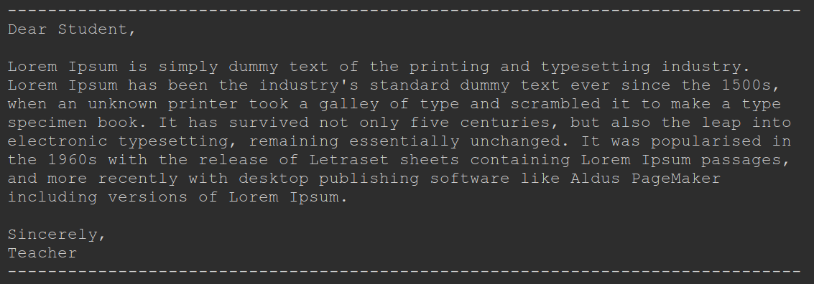

# Week 1 - Your first program!

## Day 1 
Let's get setup for the year.  We will be using an *IDE* (integrated development environment) called [Thonny](http://thonny.org).  

## *INSTRUCTIONS FOR INSTALLING THONNY HERE*

After installing Thonny, go ahead and run it.  You should get a window like the one shown in [this tutorial video](#).

**Day 1 Assignment:** 

Follow along with the instructions in the video.  Use the Python interpreter to answer
the following questions:
1. If there are 60 minutes in an hour and 60 seconds in a minute, how many seconds are in 24 hours?
2. If Danielle makes $8.75 per hour at her job and works 25 hours per week, how much did she make (before taxes)
over the summer that was 8 weeks long?
3. What is the area of a triangle with a base that is 5 cm and a height of 11 cm? (If you don't know the area formula for a triangle, use Google, Bing, DuckDuckGo, etc. to look up the *formula*)

**Day 1 Submission:**
* Open your school e-mail account (Gmail) and create a new message with the topic: **CS1 - Lesson 0 - Period 1** (replace Period 1 with with the appropriate period). 
* Copy and paste the questions above
* Put your answers between the questions
* Copy your **entire Python interpreter output** and paste it at the bottom of your e-mail
* Type the following text into the bottom of your e-mail:
  * The work I am submitting is mine.  I did not get it from anyone else.  Signed: <Your Name>

## Day 2 
Open [hello.py](hello.py) in Thonny.  Watch the [explanation video](#).  

**Day 2 Assignment:**
* Create a program called `day1answers.py` that uses print statements to print out each of the questions from yesterday, followed by the correct answer on the next line.  
    * Store the calculations for each problem in separate variables named q1ans, q2ans, and q3ans
    * Print out the original question on one line
    * Print out each answer (as complete sentences) using an f-string
  
**Day 2 Submission:**
*NOT SURE*


## Day 3 - 4
Create a new program called *letter.py* in Thonny.  This program should use
the `print` function to print out a letter to a classmate about what you did this summer.  Each line printed 
should be no more than 79 characters (including spaces and punctuation), but as close to 79 as possible.

You might want to start by seeing what 79 characters wide looks like.  Try this command:
```python 3
print('-'*79)
```

Use variables `to_name` and `from_name` and f-strings to start and end your letter.

The letter is yours, but make it at least 4 lines long, is school safe, and has as few grammatical and typographical errors as possible!

Example letter:




## Day 5

